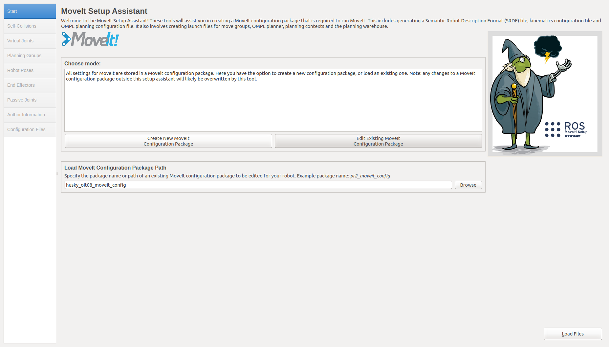
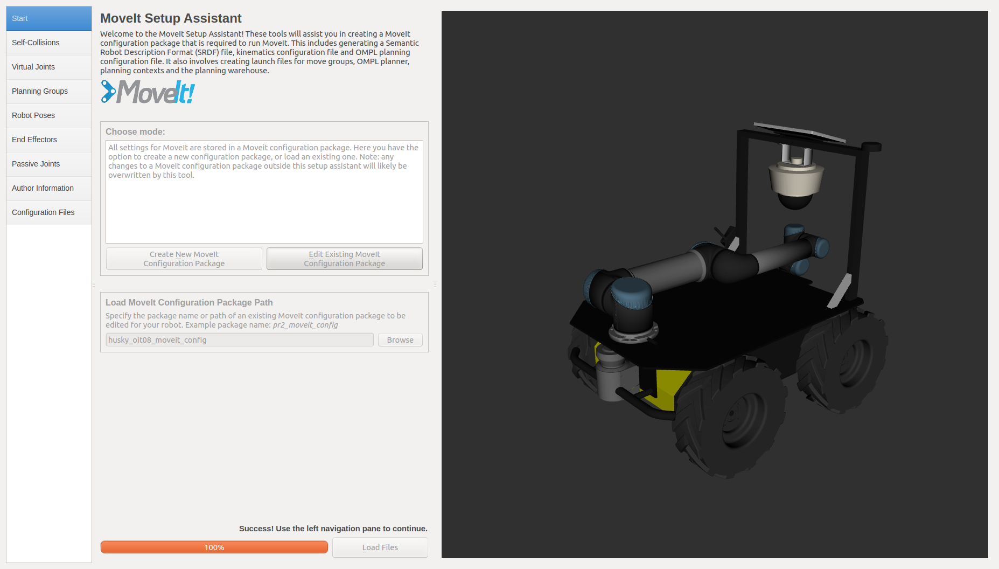
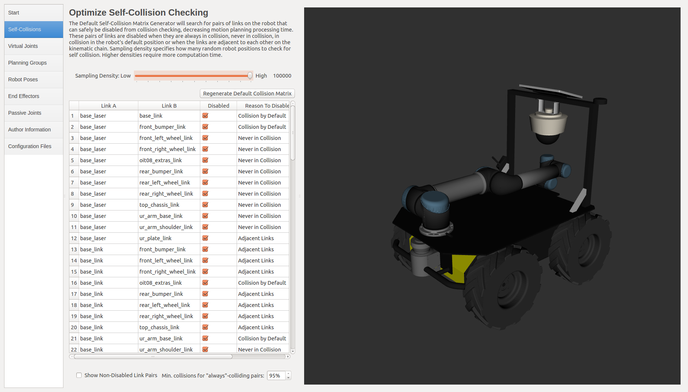
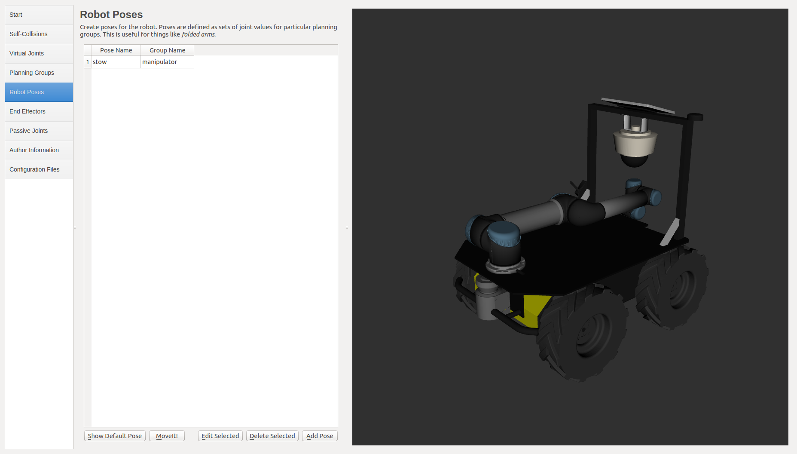
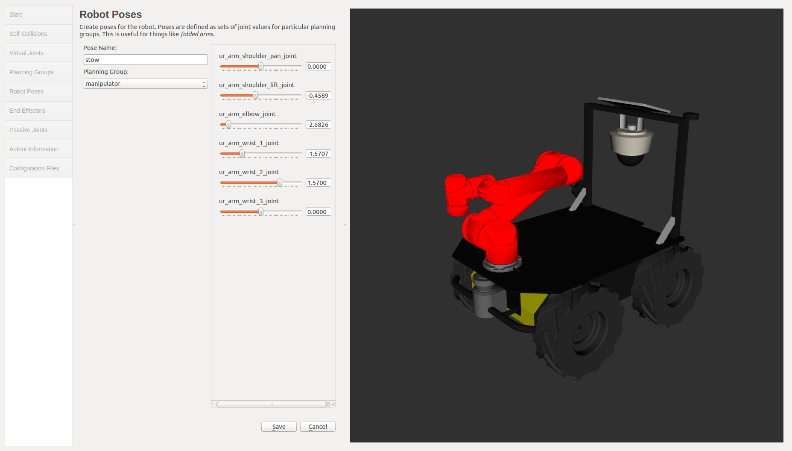
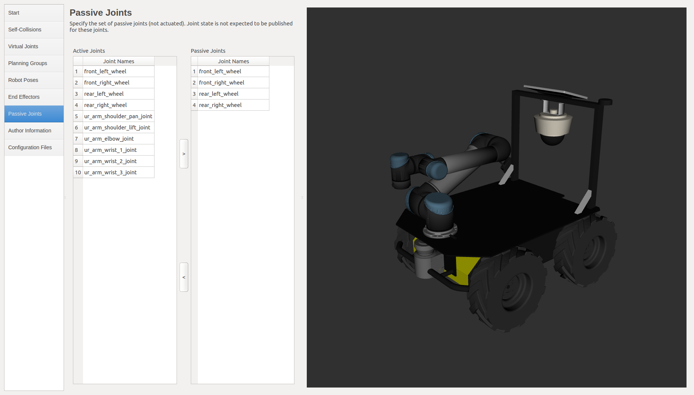
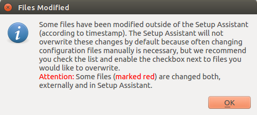
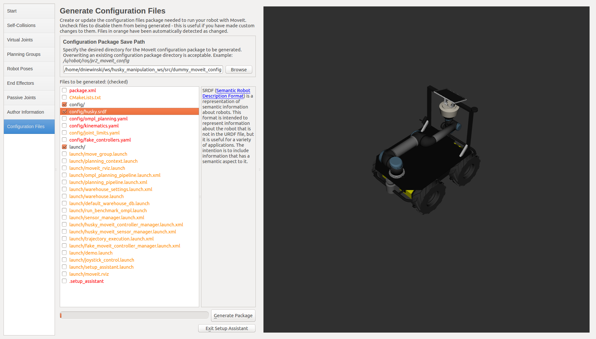

# Husky Manipulation
The purpose of this package is to make integration of manipulators much simpler.  Currently this package only includes UR5 integrations, but supported manipulators will be expanded over time.

This doc will cover the setup for a single UR husky, but the process is identical for dual arm husky or any other arm, just with slightly different package names.

## URDF
In your URDF, make sure to include the husky_manipulation description that you want. For example, if you are using a single UR5, make sure to include the line below in your URDF:

```
<xacro:include filename="$(find husky_ur_description)/urdf/husky_ur5_description.urdf.xacro" />
```

You will then want to export your URDF as the URDF_EXTRA for your robot.  This will "attach" it to the Husky.  It's convenient to add all of these into a single shell script file that can be sourced later. Make sure to source the initial script as that will make sure to set any other necessary environment variables.

```
source $(catkin_find husky_ur_description)/scripts/husky_ur5_envar.sh
export HUSKY_URDF_EXTRAS=$(catkin_find your_description_package urdf/your_description.urdf.xacro --first-only)
```

### Arm Positioning
Following above should make your Husky with an arm/arms attached to it.  They will be attached in the default locations.  If you need to change where the arm is mounted, export the necessary variables below.

```
HUSKY_LEFT_UR_XYZ
HUSKY_LEFT_UR_RPY
HUSKY_RIGHT_UR_XYZ
HUSKY_RIGHT_UR_RPY
```
Example:

```
export HUSKY_LEFT_UR_XYZ="-0.3 0.0 0.2"
```

## Update Moveit Config
MoveIt is used to actually plan and move the arm.  There are other ways to do this, but this is likely the easiest and most common.

### Setup Package
The husky_manipulation package has moveit configs setup already.  That config should work out-of-the-box for your robot, but you may get weird collisions or warnings about missing joints.  If your robot is custom, you can use that moveit config as a starting point for yours.

Go into the src folder in your workspace and run the command below:

```
rosrun husky_ur_moveit_config customize_moveit.sh <new_package_name>
```

That command will make a new moveit package in your src folder that should be ready for customization to your actual platform.

### Customize Package

*NOTE* - If you are using the custom_husky setup method (indigo), you will have to make a change to your URDF temporarily when running the setup assistant.  Remove the two lines indicated below from your URDF.  These can be added back in once your MoveIt config has been setup

```
<xacro:include filename="$(find husky_description)/urdf/husky.urdf.xacro" />
<xacro:husky_robot />
```

To customize the moveit config, run the command below:

```
roslaunch <new_package_name> setup_assistant.launch
```

That command will bring up this window



Click Load Files.  This will load the urdf into the configurator.  Keep an eye on the terminal.  You may see a couple of warnings if your config is very different from the default, but if you see a lot of warnings, something is likely not sourced properly.  Cancel this and make sure everything is sourced properly and run this again.  Check in the 3D view window on the right and make sure that is what your robot looks like.  I have seen issues lately where the 3D window is empty.  Not sure how to fix this.



Unless you want things to be very custom, there will likely be only 3 tabs you may need to change:

- Self-Collisions
- Robot Poses
- Passive Joints

### Self-Collisions



Under this, drag the slider all the way to the right and click "Regenerate Default Collision Matrix".  This may take a minute to run depending how complicated your model is.  Once it is done, take a quick look through the collisions that have been automatically disabled.  Take special notice of collisions that have been disabled because of "Collision by Default".  This means that when the joints are at zeros, it is hitting something.  Un-check any collisions that you do want to see if they happen.

### Robot Poses



These are saved, named positions that can be recalled later.  If you want to add any pre-defined poses or modify the stow position that is already there, you can click "Add Pose" or "Edit Selected" and drag the sliders to set a new position.



### Passive Joints



Passive joints are joints that MoveIt doesn't need to worry about.  These are things like wheel joints or PTUs.  Under this menu, select anything that isn't an arm joint and make sure it is in the right list.

## Save It
When you select Configuration Files, you may get a warning about files changing.  That isn't a problem, just click OK.



The next step will show you the list of files that the wizard is responsible for.  Make sure that nothing is selected except for:

- Config/
- Launch/
- config/Husky.srdf

If you modified more than the sections outlined above, you may need to edit other files, but this may have other consequences.



Once those files are selected, click Generate Package, then close down the wizard

## Running Everything
There are 2 parts to working with this on the real robot:

### Driver
Assuming the robot is all started up and the arm is setup, you should be able to run

```
roslaunch husky_ur_bringup husky_ur_bringup.launch
```

If that worked properly, you should see the arm positioned properly in RVIZ or you should see the UR joints being published on the /joint_states topic

## MoveIt!
MoveIt! is the planning and execution interface for the arm.  It runs separately from the driver.  Run the MoveIt! configuration you created above with

```
roslaunch dummy_moveit_config husky_ur_moveit_planning_execution.launch
```

You should see no errors coming up in the terminal.  You should now be able to add the Moveit MotionPlanning plugin in RVIZ and command the arm around!
